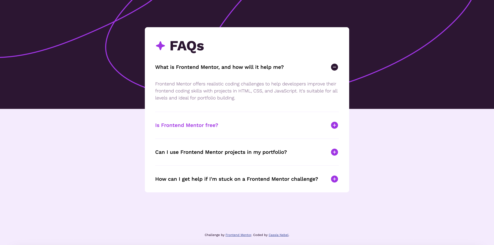

# Frontend Mentor - FAQ accordion solution

This is a solution to the [FAQ accordion challenge on Frontend Mentor](https://www.frontendmentor.io/challenges/faq-accordion-wyfFdeBwBz). Frontend Mentor challenges help you improve your coding skills by building realistic projects.

### The challenge

Users should be able to:

- Hide/Show the answer to a question when the question is clicked
- Navigate the questions and hide/show answers using keyboard navigation alone
- View the optimal layout for the interface depending on their device's screen size
- See hover and focus states for all interactive elements on the page

### Screenshot



### Links

- Live Site URL: https://cassianebel.github.io/faq-accordion/

### Built with

- Semantic HTML5 markup
- SCSS
- Flexbox
- Mobile-first workflow
- Vanilla JS

### What I learned

I learned how to animate the opening/closing of accordian style content when using the hidden attribute. It is my understanding that using hidden is best practice for accessibility.

```html
<div class="accordian">
  <h2>
    <button aria-expanded="true" aria-controls="answer1" id="question1">
      What is Frontend Mentor, and how will it help me?
    </button>
  </h2>
  <div id="answer1" role="region" aria-labelledby="question1">
    <p>
      Frontend Mentor offers realistic coding challenges to help developers
      improve their frontend coding skills with projects in HTML, CSS, and
      JavaScript. It's suitable for all levels and ideal for portfolio building.
    </p>
  </div>
</div>
```

```css
.accordian {
  div {
    overflow: hidden;
    transition: max-height 0.3s ease;
  }
}
```

```js
function toggleAccordian() {
  const isOpen = this.getAttribute("aria-expanded") === "true";
  const controls = this.getAttribute("aria-controls");
  const answer = document.getElementById(controls);

  if (!isOpen) {
    // start opening
    answer.hidden = false;
    answer.style.maxHeight = "0";

    requestAnimationFrame(() => {
      void answer.offsetHeight; // force reflow
      answer.style.maxHeight = answer.scrollHeight + "px";
    });

    this.setAttribute("aria-expanded", "true");

    answer.addEventListener(
      "transitionend",
      () => {
        answer.style.maxHeight = null; // let natural height take over
      },
      { once: true }
    );
  } else {
    // start closing
    answer.style.maxHeight = answer.scrollHeight + "px";
    requestAnimationFrame(() => {
      answer.style.maxHeight = "0";
    });

    this.setAttribute("aria-expanded", "false");

    answer.addEventListener(
      "transitionend",
      () => {
        answer.hidden = true;
        answer.style.maxHeight = null;
      },
      { once: true }
    );
  }
}
```
